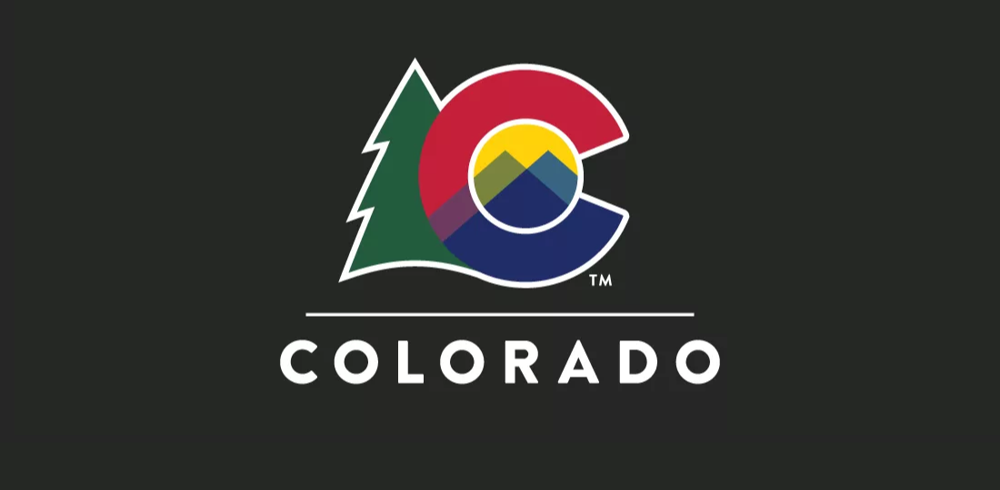
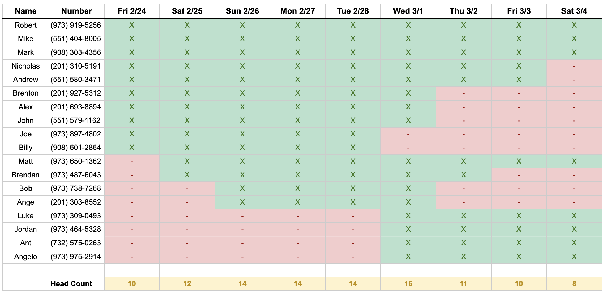
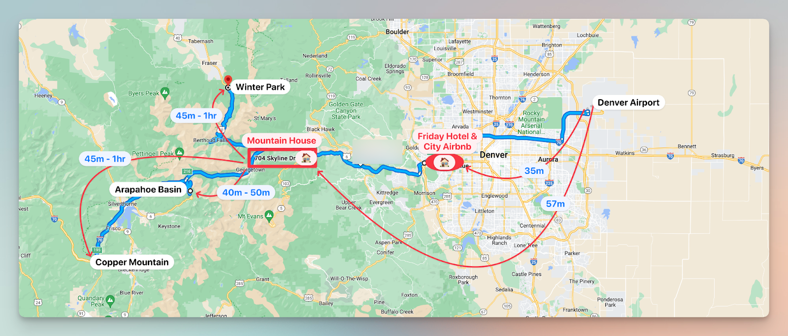

## Overview

The bachelor party starts off in the mountains from ***February 24th - March 1st***
We will be staying in Idaho Springs, CO at the mountain house <a href="https://abnb.me/MNlRSeE16ub" target="_blank">Airbnb</a>.
During this leg of the trip we will be:
- Ski/Snowboarding
- Hitting the casinos in <a href="https://www.google.com/maps/dir/704+Skyline+Drive,+Idaho+Springs,+CO+80452/Black+Hawk,+Colorado/@39.766746,-105.6054749,11z/data=!3m1!4b1!4m14!4m13!1m5!1m1!1s0x876ba4c4f6ff1911:0xb42a24ec78508723!2m2!1d-105.5329892!2d39.7321694!1m5!1m1!1s0x876bbc7a8ccbb8fb:0x4935b9a9c9693666!2m2!1d-105.4938853!2d39.7969322!3e0" target="_blank">Blackhawk</a>
- Exploring the local towns 
- Maybe finding a local hike like the <a href="https://www.alltrails.com/trail/us/colorado/clear-creek-greenway?p=-1" target="_blank">Clear Creek Greenway</a>
- Bring your cash, there is will be nightly poker games at the house

On ***Wednesday March 1st*** we will leave the mountains and move into the city <a href="http://www.airbnb.com/rooms/1402409" target="_blank">Airbnb</a> in Denver. That night we are headed to The Ball Arena to watch the the New Jersey Devils take on the Colorado Avalanche.

The trip will conclude in Denver from ***March 1st - March 5th***. Here we plan on exploring Denver, playing golf at the Overland Park <a href="https://www.cityofdenvergolf.com/overland_park" target="_blank">Golf Course</a>, hitting some local breweries, and enjoying all that the city has to offer. 

## Arrivals & Departures 

[flight schedule](Arrivals-Departures)

## Daily Itinerary 

### Friday, Feb 24th
- Joe, Billy, Alex, John, Rob, Mike, Mark, Brenton, Nicholas, Andrew arrive
- Pickup rental vehicles at Denver Airport - Alamo
	- Full Size SUV
	- Pickup Truck
- Stay at the <a href="https://www.ihg.com/holidayinnexpress/hotels/us/en/golden/dengo/hoteldetail" target="_blank">Holiday Inn Express - Denver Area</a>

### Saturday, Feb 25th
- Ski/Snowboard at <a href="http://coppercolorado.com" target="_blank">Copper Mountain</a>
	- 1hr 15min drive from hotel to Copper
	- Base area lifts are open 9am - 4pm
- Check in at Idaho Springs Airbnb available at 3:00 PM
	- [704 Skyline Drive Idaho Springs, CO 80452](https://maps.apple.com/?address=704%20Skyline%20Dr,%20Idaho%20Springs,%20CO%20%2080452,%20United%20States&ll=39.732180,-105.532942&q=704%20Skyline%20Dr&t=m)
- Matt & Brendan arrive

### Sunday, Feb 26th
- Bob & Andrew Napolitano arrive 
- Free day
	- Blackhawk casinos?
	- Local Hike?
	- Other local activities?

### Monday, Feb 27th
- Ski/Snowboard at <a href="https://www.winterparkresort.com/" target="_blank">Winter Park</a>
	- 45 minute ride from the house
	- Base area lifts are open 9am - 4pm Monday - Friday

### Tuesday, Feb 28th
- Ski/Snowboard at <a href="https://www.arapahoebasin.com/" target="_blank">Arapahoe Basin</a>
	- 40 minute ride from the house
	- Base area lifts are open 9:00 am - 4:00 pm

### Wednesday, Mar 1st
- Travel day
- Check out of Idaho Springs Airbnb at 11:00 am
- Check In to Denver Airbnb at 2:00 pm
	- [1453 Perry Street Denver, CO 80204](https://maps.apple.com/?address=1453%20Perry%20St,%20Denver,%20CO%20%2080204,%20United%20States&ll=39.739481,-105.039654&q=1453%20Perry%20St&t=m)
- Joe & Billy depart
- Jordan, Luke, Ant & Angelo arrive
- Devils game 7pm at <a href="https://maps.apple.com/?address=1000%20Chopper%20Cir,%20Denver,%20CO%2080204,%20United%20States&auid=17007286315154119348&ll=39.748650,-105.007635&lsp=9902&q=Ball%20Arena&t=m" target="_blank">The Ball Arena</a>

### Thursday, Mar 2nd
- Alex, John, Bob, Andrew N Brendan & Brenton depart
- Free day in the city

### Friday, Mar 3rd
- Golf at Overland Park <a href="https://www.cityofdenvergolf.com/overland_park" target="_blank">Golf Course</a>
- Dinner at <a href="https://www.elways.com/" target="_blank">Elway's Steakhouse</a>

### Saturday, Mar 4th
- Nicholas & Andrew depart
- Ant's birthday
- Free day in the city

### Sunday, Mar 5th
- Mark, Matt, Luke, Jordan Ant, Angelo, Rob,& Mike depart

## Map

## Questions

Rob: (973) 919-5256  
Matt: (973) 650-1362  
‬ 