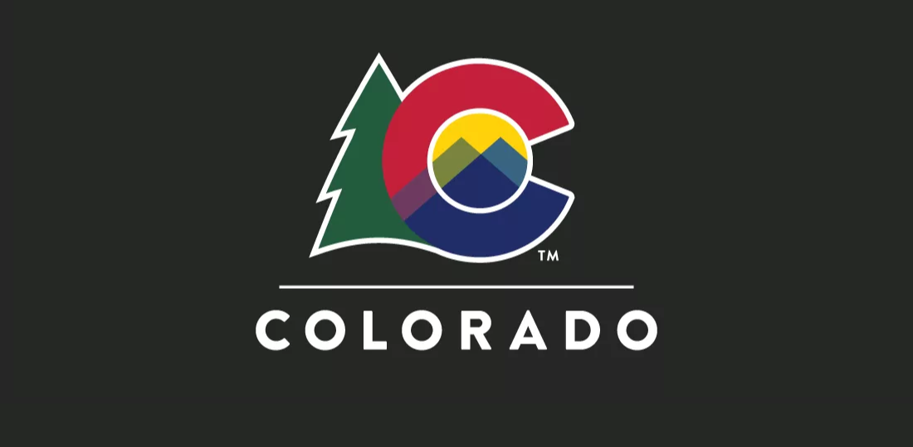
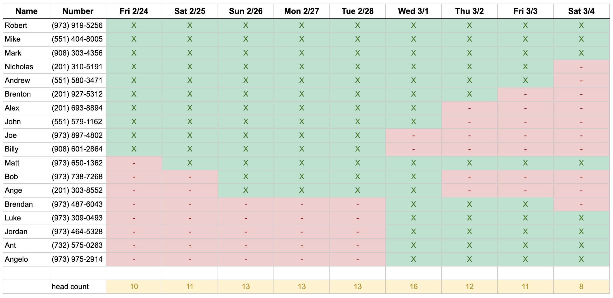

## Overview

The bachelor party trip starts off in the mountains from *February 24th - March 1st*
We will be staying in Idaho Springs, CO at this [Airbnb](https://abnb.me/MNlRSeE16ub)
During this part of the trip we will be:
- Ski/Snowboarding
- Hitting the casinos [in Blackhawk](https://www.google.com/maps/dir/Idaho+Springs,+Colorado/Black+Hawk,+Colorado/@39.7796953,-105.4908333,13.28z/data=!4m14!4m13!1m5!1m1!1s0x876ba525c91b6e55:0xfb9e9ae2915f3f68!2m2!1d-105.5136081!2d39.7424881!1m5!1m1!1s0x876bbc7a8ccbb8fb:0x4935b9a9c9693666!2m2!1d-105.4938853!2d39.7969322!3e0)
- Exploring the local towns 
- Maybe finding a local hike like Pikes Peak
- Nightly poker games at the house

On *Wednesday March 1st* we will pack up and move into a new [Airbnb](http://www.airbnb.com/rooms/1402409) in Denver. That night we are headed to The Ball Arena to watch the the New Jersey Devils take on the Colorado Avalanche.

The trip will conclude in Denver from *March 1st - March 5th*. Here we plan on exploring Denver, playing golf at the Overland Park [Golf Course](https://denver.ezlinksgolf.com/index.html#/search), hitting some local breweries, and enjoying all that the city has to offer. 

---
## Arrivals & Departures 

---
## Daily Itinerary 

