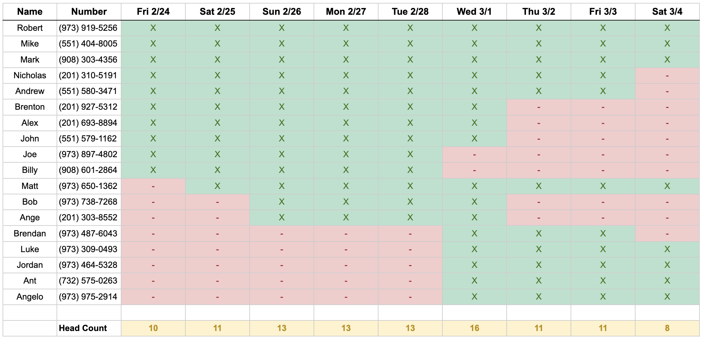

## Overview

The bachelor party starts off in the mountains from ***February 24th - March 1st***
We will be staying in Idaho Springs, CO at the mountain house <a href="https://abnb.me/MNlRSeE16ub" target="_blank">Airbnb</a>
During this part of the trip we will be:
- Ski/Snowboarding
- Hitting the casinos <a href="https://www.google.com/maps/dir/Idaho+Springs,+Colorado/Black+Hawk,+Colorado/@39.7796953,-105.4908333,13.28z/data=!4m14!4m13!1m5!1m1!1s0x876ba525c91b6e55:0xfb9e9ae2915f3f68!2m2!1d-105.5136081!2d39.7424881!1m5!1m1!1s0x876bbc7a8ccbb8fb:0x4935b9a9c9693666!2m2!1d-105.4938853!2d39.7969322!3e0" target="_blank">in Blackhawk</a>
- Exploring the local towns 
- Maybe finding a local hike like Pikes Peak
- Nightly poker games at the house

On ***Wednesday March 1st*** we will leave the mountains and move into a new city <a href="http://www.airbnb.com/rooms/1402409" target="_blank">Airbnb</a>  in Denver. That night we are headed to The Ball Arena to watch the the New Jersey Devils take on the Colorado Avalanche.

The trip will conclude in Denver from ***March 1st - March 5th***. Here we plan on exploring Denver, playing golf at the Overland Park <a href="https://denver.ezlinksgolf.com/index.html#/search" target="_blank">Golf Course</a>, hitting some local breweries, and enjoying all that the city has to offer. 

## Arrivals & Departures 

[see more](Arrivals-Departures)

## Daily Itinerary 

### Friday, Feb 24th
- Joe, Billy, Alex, John, Rob, Mike, Mark, Brenton, Nicholas, Andrew arrive
- Pickup rental vehicles at Denver Airport - Alamo
	- Full Size SUV
	- Pickup Truck
- Stay at the <a href="https://www.ihg.com/holidayinnexpress/hotels/us/en/golden/dengo/hoteldetail" target="_blank">Holiday Inn Express - Denver Area</a>

### Saturday, Feb 25th
- Ski/Snowboard at <a href="http://coppercolorado.com" target="_blank">Copper Mountain</a>
	- 1hr 15min drive from hotel to Copper
	- Base area lifts are open 9am - 4pm
- Check in at Idaho Springs Airbnb available at 3:00 PM
	- 704 Skyline Drive Idaho Springs, CO 80452
- Matt arrives

### Sunday, Feb 26th
- Bob and Andrew Napolitano arrive 
- Free day
	- Blackhawk casinos?
	- Pikes Peak?
	- Local activities?

### Monday, Feb 27th
- Ski/Snowboard at <a href="https://www.winterparkresort.com/" target="_blank">Winter Park</a>
	- 45 minute ride from the house
	- Base area lifts are open 9am - 4pm Monday - Friday

### Tuesday, Feb 28th
- Ski/Snowboard at <a href="https://www.arapahoebasin.com/" target="_blank">Arapahoe Basin</a>
	- 40 minute ride from the house
	- Base area lifts are open 9:00 a.m. - 4:00 p.m.

### Wednesday, Mar 1st
- Travel day
- Check out of Idaho Springs Airbnb at 11:00 am
- Check In to Denver Airbnb at 2:00pm
	- 1453 Perry Street Denver, CO 80204
- Joe & Billy depart
- Brendan, Jordan, Luke, Ant, & Angelo arrive
- Devils game at 7pm

### Thursday, Mar 2nd
- Alex, John, Bob, Andrew N, & Brenton depart
- Free day in the city

### Friday, Mar 3rd
- Golf at Overland Park Golf Course
- Dinner at Elway's Steakhouse

### Saturday, Mar 4th
- Brendan, Nicholas, & Andrew depart
- Ant's birthday
- Free day in the city

### Sunday, Mar 5th
- Mark, Matt, Luke, Jordan Ant, Angelo, Rob, & Mike depart

## Map

## Questions
Rob Evanik: (973) 919-5256  
Matt Rudolph: (973) 650-1362‬ 

This text is red!

