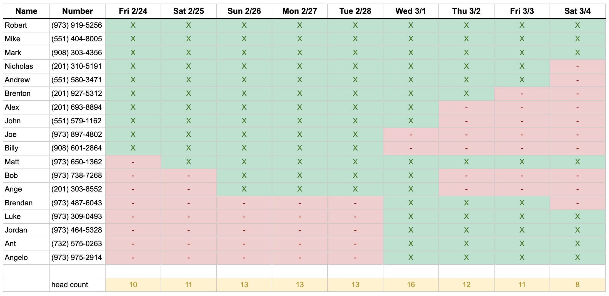

## Overview

The bachelor party starts off in the mountains from *February 24th - March 1st*
We will be staying in Idaho Springs, CO at the mountain house <a href="https://abnb.me/MNlRSeE16ub" target="_blank">Airbnb</a>
During this part of the trip we will be:
- Ski/Snowboarding
- Hitting the casinos <a href="https://www.google.com/maps/dir/Idaho+Springs,+Colorado/Black+Hawk,+Colorado/@39.7796953,-105.4908333,13.28z/data=!4m14!4m13!1m5!1m1!1s0x876ba525c91b6e55:0xfb9e9ae2915f3f68!2m2!1d-105.5136081!2d39.7424881!1m5!1m1!1s0x876bbc7a8ccbb8fb:0x4935b9a9c9693666!2m2!1d-105.4938853!2d39.7969322!3e0" target="_blank">in Blackhawk</a>
- Exploring the local towns 
- Maybe finding a local hike like Pikes Peak
- Nightly poker games at the house

On *Wednesday March 1st* we will leave the mountains and move into a new city <a href="http://www.airbnb.com/rooms/1402409" target="_blank">Airbnb</a>  in Denver. That night we are headed to The Ball Arena to watch the the New Jersey Devils take on the Colorado Avalanche.

The trip will conclude in Denver from *March 1st - March 5th*. Here we plan on exploring Denver, playing golf at the Overland Park <a href="https://denver.ezlinksgolf.com/index.html#/search" target="_blank">Golf Course</a>, hitting some local breweries, and enjoying all that the city has to offer. 

## Arrivals & Departures 

See more

| Name     | Arrival  | Time    | Departure | Time |
| -------- | -------- | ------- | --------- | ---- |
| Joe      | Fri 24th | 4:00pm  |           |      |
| Billy    | Fri 24th | 7:00pm  |           |      |
| Alex     | Fri 24th | 7:30pm  |           |      |
| John     | Fri 24th | 7:30pm  |           |      |
| Rob      | Fri 24th | 10:00pm |           |      |
| Mike     | Fri 24th | 10:00pm |           |      |
| Mark     | Fri 24th | 10:00pm |           |      |
| Brenton  | Fri 24th | 10:00pm |           |      |
| Nicholas | Fri 24th | 10:00pm |           |      |
| Andrew   | Fri 24th | 10:00pm |           |      |

## Daily Itinerary 

### Friday, Feb 24th

- Pickup rental vehicles at Denver Airport - Alamo
	- Full Size SUV
	- Pickup Truck
- Stay at the <a href="https://www.ihg.com/holidayinnexpress/hotels/us/en/golden/dengo/hoteldetail" target="_blank">Holiday Inn Express - Denver Area</a>

### Saturday, Feb 24th

### Sunday, Feb 24th

### Monday, Feb 24th

### Tuesday, Feb 24th

### Wednesday, Mar 1st

### Thursday, Mar 2nd

### Friday, Mar 3rd

### Saturday, Mar 4th

### Sunday, Mar 5th

## Map

## Questions
Rob Evanik: (973) 919-5256  
Matt Rudolph: (973) 650-1362‬

This text is red!

